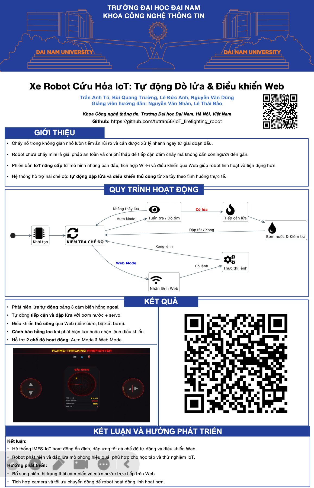

<h1 align="center">🚒 Xe Robot Cứu Hỏa IoT: Tự động Dò lửa & Điều khiển Web </h1>

<div align="center">

<p align="center">
  
    
</p>

[](https://www.facebook.com/DNUAIoTLab)
[](https://fitdnu.net/)
[](https://dainam.edu.vn)
</div> 

Một mô hình **xe chữa cháy mini** có khả năng:

- Tự di chuyển, tránh vật cản  
- Phát hiện lửa bằng **cảm biến flame 3 hướng**  
- Tiến lại gần đám cháy và **tự xoay vòi phun** về phía ngọn lửa  
- **Phun nước** dập lửa khi đủ gần, kèm còi & đèn cảnh báo
- Điều khiển thủ công qua Web

---
## 🔥 Giới thiệu

Dự án mô phỏng một **xe chữa cháy mini thông minh** dùng Arduino, kết hợp:

- **Cảm biến lửa** (trái – giữa – phải) để xác định hướng đám cháy  
- **Cảm biến siêu âm** để đo khoảng cách và tránh vật cản  
- **Cảm biến mực nước** để kiểm tra còn nước hay không  
- **Servo** để xoay vòi phun đúng hướng  
- **Máy bơm nước** để phun khi đến gần đám cháy  


## 🖼 Poster dự án


<p align="center">
  
</p>

---


## ✨ Tính năng chính

- 🚗 **Tự động di chuyển** khi không có lửa  
  - Đi thẳng khi không có vật cản  
  - Gặp vật cản thì **lùi lại, rẽ trái và đi tiếp**

- 🔍 **Phát hiện lửa đa hướng**  
  - 3 cảm biến lửa: **trái (L), giữa (C), phải (R)**  
  - Lọc nhiễu bằng cách đọc nhiều lần rồi mới kết luận có lửa

- 🎯 **Tự xoay vòi phun đúng hướng lửa**  
  - Lửa bên trái → xoay vòi sang trái  
  - Lửa bên phải → xoay vòi sang phải  
  - Lửa ở cả hai bên hoặc ở giữa → quay về giữa

- 🚨 **Chế độ chữa cháy tự động**  
  - Tiến lại gần đám cháy  
  - Khi đủ gần → dừng xe, bật bơm, phun nước  
  - Bật **LED cảnh báo lửa** + **buzzer** khi phát hiện lửa

- 💧 **Giám sát mực nước**  
  - Hết nước → dừng xe, tắt bơm, đưa vòi về giữa  
  - Bật LED báo hết nước

- 🧠 **Debug qua Serial Monitor**  
  - Log: khoảng cách, mực nước, trạng thái lửa, trạng thái bơm, trạng thái xe

---

## 🧩 Phần cứng sử dụng

Gợi ý phần cứng (có thể thay đổi theo module thực tế):

- 1× **Arduino Uno / Nano**  
- 1× Module **L298N / driver động cơ** (2 DC motor)  
- 2× Động cơ DC + bánh xe (robot car)  
- 1× **Servo** (SG90 hoặc tương đương) – xoay vòi phun  
- 1× Cảm biến siêu âm **HC-SR04**  
- 3× Cảm biến lửa (Flame sensor) **trái / giữa / phải**  
- 1× Cảm biến mực nước (analog)  
- 1× **Module máy bơm nước mini + motor pump**  
- 2× LED (báo lửa, báo hết nước)  
- 1× **Buzzer**  
- Dây nối, nguồn 5V/12V, khung xe, ống dẫn nước,...

---


## 🧠 Nguyên lý hoạt động

**Mô tả ngắn gọn vòng lặp chính:**

1. **Đọc mực nước**  
   - Nếu giá trị cảm biến < `waterThreshold` → xem như **hết nước**  
   - Hết nước ⇒ dừng xe, tắt bơm, bật LED báo nước, đưa vòi phun về giữa  

2. **Đọc khoảng cách** bằng HC-SR04  
   - Nếu vật quá gần, cảm biến có thể trả về 0 → xử lý qua biến `tooClose`  

3. **Lọc nhiễu cảm biến lửa**  
   - Đọc 5 lần; nếu ≥ 3 lần phát hiện lửa ⇒ `fireDetected = true`  

4. **Khi không có lửa**  
   - Nếu không có vật cản (khoảng cách > `obstacleStopDist`) → xe **chạy thẳng**  
   - Nếu có vật cản gần → **dừng → lùi → rẽ trái → đi tiếp**  

5. **Khi có lửa & còn nước**  
   - Bật **LED_FIRE** + **buzzer**  
   - Nếu có vật cản quá gần → ưu tiên né (lùi + rẽ trái)  
   - Xác định **hướng lửa** (L/C/R) và xoay servo: trái, phải hoặc giữa  
   - Nếu khoảng cách đến lửa ≤ `fireSprayDist` hoặc `tooClose`:
     - Dừng xe  
     - Bật bơm nếu chưa bật  
     - Cho xe tiến chậm thêm một đoạn ngắn, rồi dừng để phun tại chỗ  
   - Nếu đang phun mà mất lửa → **tắt bơm ngay**, servo đưa về giữa  

Chi tiết toàn bộ logic có thể xem trong file `.ino` trong thư mục `src/`.

---

## 🛠 Cài đặt & Upload code

1. Cài **Arduino IDE**  
2. Kết nối Arduino với máy tính  
3. Đảm bảo đã có thư viện:

   ```cpp
   #include <Servo.h>
   
## 🤝 Đóng góp
Dự án được phát triển bởi các thành viên:

| Họ và Tên                | Vai trò                  |
|--------------------------|--------------------------|
| Trần Anh Tú              | Cập nhật sau.|
| Bùi Quang Trường      | Cập nhật sau.|
| Lê Đức Anh    | Cập nhật sau.  |
| Nguyễn Văn Dũng    | Cập nhật sau.  |

© 2025 NHÓM 9, CNTT 17-01, TRƯỜNG ĐẠI HỌC ĐẠI NAM

